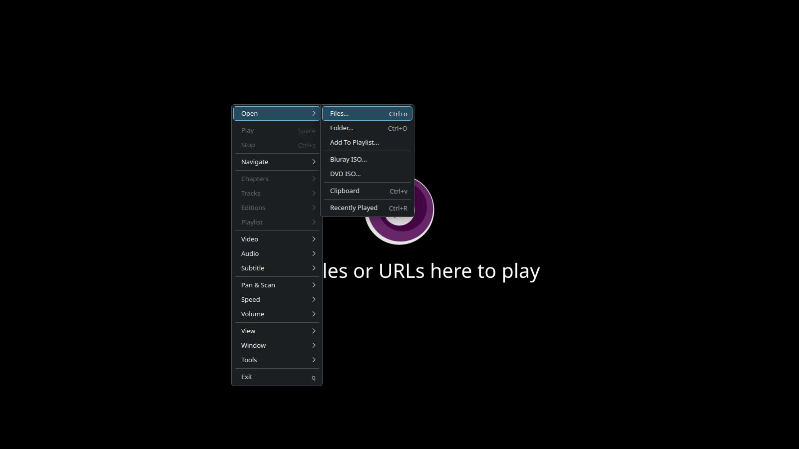

# mpvqt-menu



Configurable native Qt context menu for [mpv](https://mpv.io/) on Linux, with
additional support for file dialogs and clipboard integration.

This project is an independent Linux port based on
[tsl0922/mpv-menu-plugin](https://github.com/tsl0922/mpv-menu-plugin).

## Features

- Configurable native Qt 6 context menu
- Open files and folders with native file dialogs
- Open media from the clipboard
- Dynamic tracks, chapters, editions, playlists and profiles
- X11 and XWayland support

## Requirements

- Linux with X11 or Wayland through XWayland
- mpv 0.37.0 or newer, built with `cplugins` support
- Qt 6.2 or newer (`Core`, `Gui` and `Widgets`)
- A C++17 compiler
- `make`, `pkg-config`, `binutils` and mpv development headers

### Arch Linux

```sh
sudo pacman -S --needed base-devel mpv qt6-base xorg-xwayland libxcb xcb-util-cursor vulkan-icd-loader
```

### Debian and Ubuntu

```sh
sudo apt install build-essential pkg-config binutils libmpv-dev qt6-base-dev libxcb1-dev xwayland
```

## Installation

Build the plugin and copy `menu.so` and `menu.lua` to the current user's mpv
scripts directory:

```sh
make install
```

To only build the plugin, run:

```sh
make
```

The resulting files will be placed in `dist/`.

> [!IMPORTANT]
> This plugin does not include a built-in default menu. Menu entries must be
> defined in your mpv `input.conf`, otherwise no menu will be displayed.

## Configuration

- [Documentation](#inputconf)
- [Examples](https://gist.github.com/snwkkj/17c770dad84e07c1d33576d465481cc9)

### input.conf

Menu titles are defined after `#menu:`. Use `>` to create submenus and `-` to
create separators:

```conf
Ctrl+o script-message-to dialog open          #menu: Open > Files...
Ctrl+O script-message-to dialog open-folder   #menu: Open > Folder...
_ ignore                                      #menu: -
Space cycle pause                             #menu: Play/Pause
q quit                                        #menu: Exit
```

English and Portuguese examples are available in the
[configuration Gist](https://gist.github.com/snwkkj/17c770dad84e07c1d33576d465481cc9)
and in the local [`examples`](examples/) directory.

### Wayland

The Qt menu uses XWayland so it can share global pointer coordinates with mpv.
Add the following options to your `mpv.conf` to make the menu follow the mouse
on Wayland. This configuration works with both AMD and NVIDIA Vulkan drivers:

```conf
vo=gpu-next
gpu-api=vulkan
gpu-context=x11vk
target-colorspace-hint=auto
```

See [`examples/mpv.conf`](examples/mpv.conf) for the ready-to-copy example.

## License

[GPL-2.0](LICENSE.txt)
